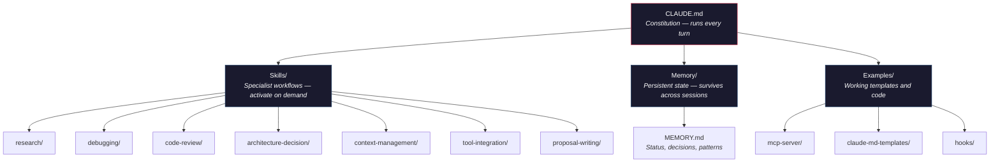

# Claude Code Starter Kit

**Stop re-explaining your project to Claude every session.**

Most Claude Code setups are a single CLAUDE.md with a few vague lines. This kit gives you the architecture that emerges after months of daily production use: structured skills that trigger automatically, persistent memory that survives across sessions, and project rules that prevent Claude from making the same mistakes twice.

Drop it into your project. Customize it in 10 minutes. Watch Claude behave like a team member who's been onboarded.

[](https://opensource.org/licenses/MIT)

---

## What Changes

| Without this | With this |
|---|---|
| Claude forgets context every session | Memory persists decisions, patterns, and status |
| You re-explain your debugging process | A skill triggers automatically and follows your methodology |
| Claude skips verification and says "it works" | A rule forces it to run code and show proof before claiming done |
| Every task starts from zero | Claude reads your rules, skills, and memory before its first response |

---

## Quick Start

```bash
git clone https://github.com/martingarramon/claude-code-starter-kit.git
cd claude-code-starter-kit
chmod +x setup.sh
./setup.sh /path/to/your/project
```

Or just copy the files manually -- there is no magic here, only structure.

---

## Architecture

Claude Code reads instructions from three layers. This kit gives you a working version of each.



```
your-project/
  CLAUDE.md                          # The constitution -- runs every turn
  memory/
    MEMORY.md                        # Persistent brain -- decisions, status, patterns
  skills/
    research/SKILL.md                # Multi-source research with recommendations
    debugging/SKILL.md               # Systematic root-cause analysis
    code-review/SKILL.md             # Security, quality, maintainability review
    architecture-decision/SKILL.md   # ADR process for technical choices
    context-management/SKILL.md      # Context window hygiene and memory updates
    tool-integration/SKILL.md        # MCP servers and external API connections
    proposal-writing/SKILL.md        # Client proposals and project pitches
  .claude/
    settings.json                    # Permission configuration
  examples/
    mcp-server/                      # Working MCP server (project notes store)
    claude-md-templates/             # CLAUDE.md for SaaS, Python API, and more
    hooks/                           # Session-start and post-tool-use hook examples
```

**CLAUDE.md** tells Claude *how to behave*. It runs every turn, so keep it tight -- rules, not essays. This template includes MCP usage protocols, memory management rules, self-review loops, and context window hygiene -- all extracted from production use.

**Skills** tell Claude *how to do specific jobs*. They only activate when relevant, so they can be detailed without bloating every interaction.

**Memory** tells Claude *what happened before*. Without it, every session starts from zero. With it, context compounds over time.

---

## What's Included

### CLAUDE.md -- Battle-Tested Rules

The template includes rules that changed real behavior in production:

- **"Verify before claiming done."** Without this, Claude confidently presents broken code. With it, the quality of output jumps immediately.
- **"State the verification method first."** Forces Claude to think about testing before writing -- catches architectural mistakes early.
- **"No guessing."** Prevents fabricated URLs, endpoints, and config values. Simple rule, massive impact.
- **"One step at a time."** Stops Claude from dumping 15-step checklists. You get the next action, then the next.

### Skills -- Specialist Workflows

| Skill | What It Does |
|-------|-------------|
| **Research** | Decomposes questions into sub-queries, researches in parallel, synthesizes with confidence levels, and forms a specific recommendation -- not "it depends" |
| **Debugging** | Systematic root-cause analysis: reproduce, gather evidence, hypothesize, test, fix, document. No shotgun debugging, no random patches |
| **Code Review** | Structured review covering correctness, security, maintainability, and performance. Critical issues first, nitpicks last, every criticism includes a fix |
| **Architecture Decision** | ADR process for technical choices: frame the decision, evaluate max 3 options, recommend with explicit tradeoffs, document for future developers |
| **Context Management** | Context window hygiene: progressive loading, bloat detection, memory updates at breakpoints. Keeps Claude sharp across long sessions |
| **Tool Integration** | MCP server and external API connection workflow: define, design, implement, test, document. Includes MCP server checklist and anti-patterns |
| **Proposal Writing** | Problem-first structure: client's pain in their language, specific approach, concrete deliverables, clear next step. No filler, no jargon |

### Memory -- Persistent State

Sections for project status, key decisions, patterns learned, and frequently used commands. Claude updates this during sessions and reads it at the start of the next one.

The template includes guidance on what to store (decisions that would be expensive to re-research) and what not to store (anything that belongs in code comments).

### Examples

Ready-to-use starting points:

| Example | What It Is |
|---------|-----------|
| `examples/mcp-server/` | Minimal working MCP server in Python. Gives Claude persistent read/write access to a local notes store. Use as a template for your own MCP servers. |
| `examples/claude-md-templates/saas-webapp.md` | CLAUDE.md for Next.js + Prisma + PostgreSQL projects. Rules for migrations, TypeScript strictness, and server component defaults. |
| `examples/claude-md-templates/python-api.md` | CLAUDE.md for FastAPI + SQLAlchemy projects. Rules for async correctness, Alembic migrations, and dependency injection. |
| `examples/hooks/session-start.sh` | Shell hook that runs at session start: shows git status and reminds Claude to read memory. |
| `examples/hooks/post-tool-use.sh` | Shell hook that logs tool errors to `.claude/error-log.txt` for review. |

---

## How to Customize

**Start small.** Three to five rules in CLAUDE.md. Add one every time Claude does something you have to correct twice.

**Skills are recipes.** Each SKILL.md follows a pattern: when to activate, the process, and the output format. Write new skills for any workflow where you find yourself re-explaining the same process.

**Memory is state, not documentation.** Store decisions, status, and patterns. Delete anything stale at the start of each session.

---

## Design Principles

- **Rules come from mistakes.** Don't pre-optimize. Add rules when Claude gets something wrong.
- **Skills are specialists, not essays.** Each skill does one job. Keep them focused.
- **Memory is for state, not documentation.** Store decisions and patterns, not prose.
- **Less is more.** Claude reads CLAUDE.md every turn. Every unnecessary line costs attention.

---

## The Full System

This starter kit covers the fundamentals. The system it was extracted from runs production work daily with:

- 40+ custom skills with automatic activation triggers
- 200+ lines of battle-tested CLAUDE.md rules
- Multi-project memory architecture with cross-session persistence
- Custom MCP server orchestration (Notion, Google Drive, browser automation, and more)
- Automated verification protocols that catch bugs before they ship
- Dual-AI adversarial review (Claude builds, a second model attacks blind spots)

---

## Want This Built For Your Codebase?

This kit is the starting point. The system it was extracted from runs 40+ custom skills, multi-project memory, MCP server orchestration, and automated verification across production work daily.

If you want a custom Claude Code environment built for your team's stack and workflows, reach out -- I do this as a service.

**Martin Garramon** -- AI Systems Architect
[LinkedIn](https://linkedin.com/in/martin-garramon) | martin@yulicreative.ai | [yulicreative.ai](https://yulicreative.ai)
